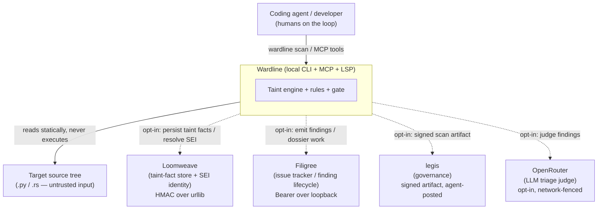
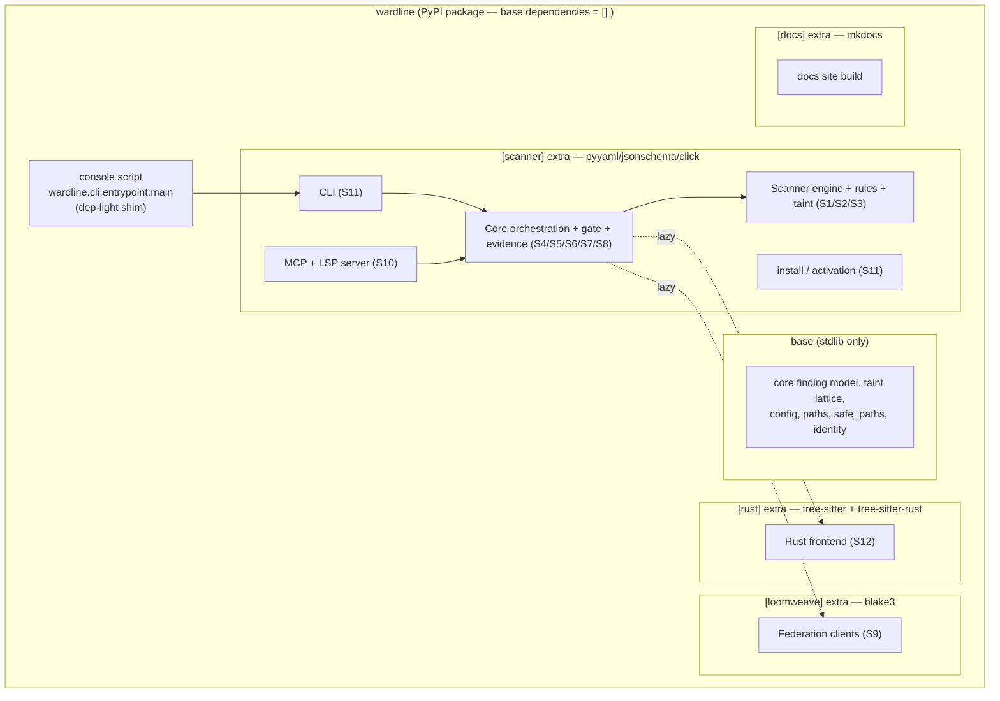
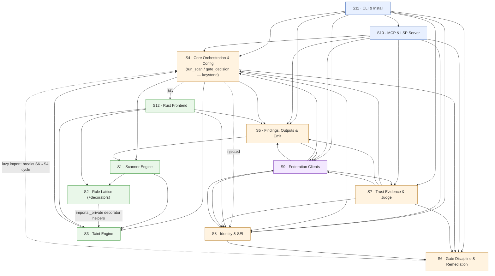
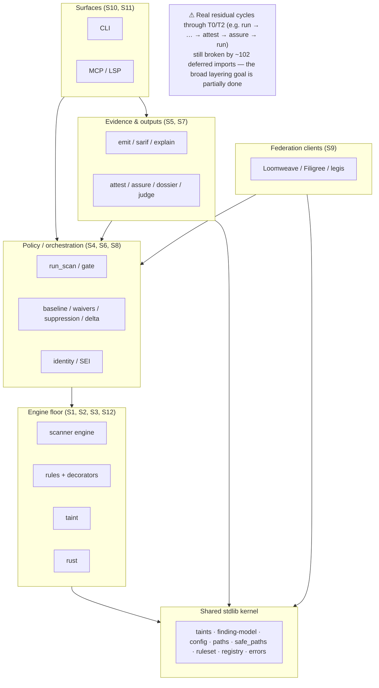
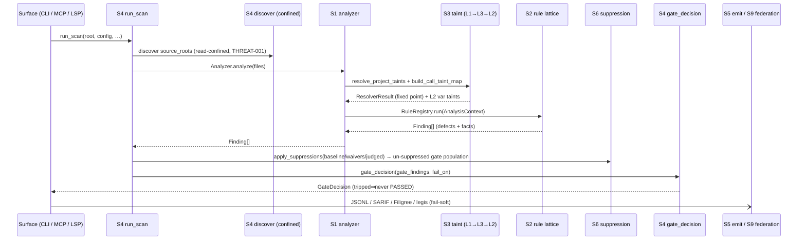

# 03 — Architecture Diagrams

**Target:** `wardline` @ `e4668abc` · **Date:** 2026-06-28. Edges below are taken from the
Loomweave-graph-derived dependency sections of `02-subsystem-catalog.md` (not import inference).

---

## C1 — System Context

Who uses Wardline and what it talks to. Wardline is **local-first**: every external link is opt-in and
fail-soft — a sibling outage degrades a section, never breaks a scan.

---

## C2 — Containers / Packaging

The **zero-dependency base** is a hard product invariant; capability ships behind small extras. One
package, several runnable surfaces, all routing through one shared core.

---

## C3 — Components (the 12 subsystems) & their dependency edges

Coupling is largely one-directional **surfaces → orchestration → engine**, with federation/identity as
leaves and a few back-edges (noted). `run_scan`/`gate_decision` (S4) is the keystone both surfaces share.

**Back-edges / cycles worth seeing (from the catalog):**
- **S6 ↔ S4** — `core/run.py` imports the S6 baseline/suppression loaders; `baseline.collect_and_write_baseline`
  lazy-imports `run.run_scan` at call time (`baseline.py:232`) to break the cycle.
- **S2 → S3 (private)** — rules import `decorator_provider._is_builtin_decorator_fqn` / `_shadowed_builtin_roots`.
- **S3 → S4 (`core.taints`/`core.ruleset`)** — the taint *lattice* and `ruleset_hash` physically live in
  `core/` but are the engine's vocabulary; `ruleset_hash` was deliberately rehomed *below* both engine and
  attest to remove the old engine→attest inversion (closed `wardline-9ec283d168`).
- **S5 → S1** — `explain.py` reads `AnalysisContext` provenance maps directly (no narrow interface).

---

## Intended layering vs reality

The closed ticket `wardline-9ec283d168` defines the intended layering **engine ⇦ policy ⇦ surface ⇦
federation**. The single import-linter contract that encodes one slice of it (`scanner ⇏ core.attest`)
**passes** (1 kept/0 broken). But the broader goal is only *partially* realized — the catalog and the
ticket's own close-note show real `core/` cycles still broken by **~102 function-local imports** (down
from 158).

---

## Scan pipeline (sequence)

The behaviour both `wardline scan` (S11) and the MCP `scan` tool (S10) share — **identical by
construction** because both call `run_scan`/`gate_decision`.

